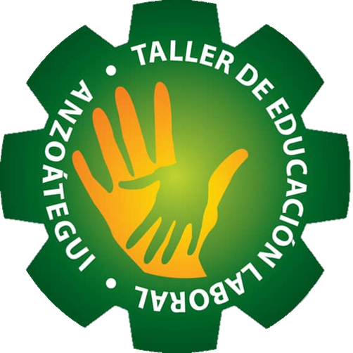

# 🟢TELA APP 💻🟢

### ¿Qué es el TELA APP?
Este es un proyecto universitario de la **Universidad Politécnica Territorial José Antonio Anzoátegui (UPTJAA)** para el **Taller de Educación laboral Anzoátegui (TELA)**, como requisito para optar por el titulo de ingenieria en informática.

  
  
  
  

## Contenido

- [¿Qué es el TELA APP?](#qué-es-el-tela-app)
- [¿De que se trata el sistema de información?](#de-que-se-trata-el-sistema-de-información)

## ¿De que se trata el sistema de información?
Es un sistema de información que se encargar de registar y consultar de información de los alumnos y del personal docente, obrero, administrativo y directivo.

## Herramientas Utilizadas para el desarrollo del sistema de información

