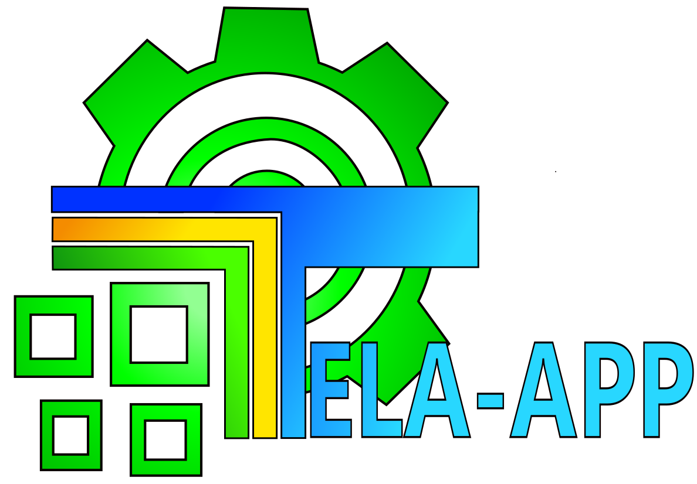

# AVISO IMPORTANTE

# Este repositorio es **UN PROYECTO UNIVERSITARIO**, esto no tiene ningun fin de lucro, todo este software es libre.

## Si deseas probar el sistema haz click [aqui](https://github.com/Enmanuel-86/TELA-APP/releases/tag/TELA-APP_Nuevas_versiones_(DEMO)) 💡

# 🟢TELA APP 💻🟢

  

### ¿Qué es el TELA APP?
Este es un proyecto universitario de la **Universidad Politécnica Territorial José Antonio Anzoátegui (UPTJAA)** para el **Taller de Educación laboral Anzoátegui (TELA)**, como requisito para optar por el titulo de ingenieria en informática.

  
  

  
  
  
  

## Contenido
  
- [¿Qué es el TELA APP?](#qué-es-el-tela-app) ❓
- [¿De que se trata el sistema de información?](#de-que-se-trata-el-sistema-de-información) ❓
- [Herramientas Utilizadas para el desarrollo del sistema de información](#herramientas-utilizadas-para-el-desarrollo-del-sistema-de-información) 🧰
- [¿Como funciona TELA-APP?](#como-funciona-tela-app) 💠

## ¿De que se trata el sistema de información?
Es un sistema de información que se encargar de registar y consultar información de los alumnos y del personal docente, obrero, administrativo y directivo.

## Herramientas Utilizadas para el desarrollo del sistema de información
Las herramientas que se utilizaron para es desarrollo de este proyecto fueron:

 

### 1️⃣ Para la logica y control de todo el sistema:

|Python|
|------|
||

 

### 2️⃣ Para el desarrollo de las interfaces gráficas:

| PyQt5 | QtDesigner |                                            
|-------|------------|
| | |

 

### 3️⃣ Para la base de datos:

|SQlite|SQLalchemy|
|------|----------|
|| 

# 
## ¿Como funciona TELA-APP?

<ol>
  <li>
    <b>Registra Informacion:</b> este sistema registra toda la informacion requerida del taller de educacion laboral anzoategui, registra la informacion de los alumnos y del personal.</li>
  [insertar imagen relacionada a registrar]

  <li>
    <b>Consulta la informacion que se registro:</b> se puede consultar toda la informacion que se registro en el sistema.
    [insertar imagenes de como se consulta ]
  </li>

  <li>
    <b>Genera el encabezado de los informes integrales de los alumnos:</b>a partir de los datos registrados se puede generar los encabezado de los informes que se le realizan a los alumnos. (parte actualmente en desarrollo)
    [insertar imagen de el encabezado pero censurado]
  </li>

  <li>
    <b>Genera reportes de todas las acciones realizadas en el sistema:</b> el sistema genera reportes de todos las       acciones realizadas para ver quien hizo tal cosa.
    [insertar imagen de ese reporte]
    este reporte solo lo puede generar y ver el usuario con rol administrador 
    
  </li>

  <li>
    <b>Genera respaldos:</b>el sistema genera respaldos para resguardar la informacion y de exportar en caso de  instalar el sistema en otro equipo.
    [insertar imagen de la pantalla de respaldo]
  
  </li>  

  
</ol>

<h1>Toda la descripcion de como funciona y como se puede modificar el proyecto estara cuando se termine</h1>

