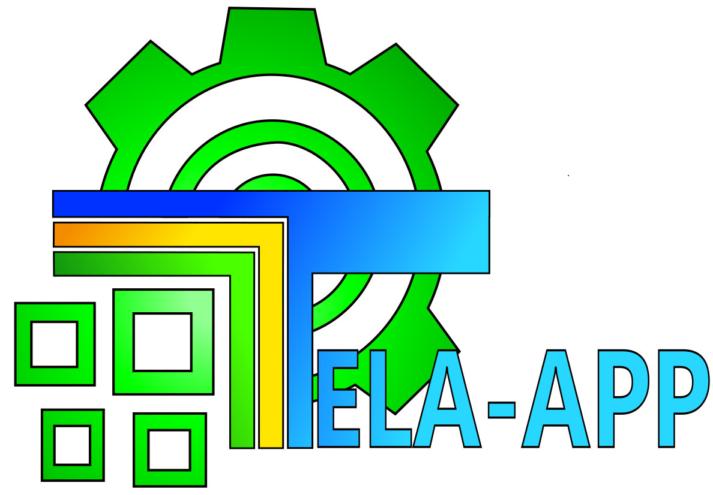

# AVISO IMPORTANTE

# Este repositorio es **UN PROYECTO UNIVERSITARIO**, esto no tiene ningun fin de lucro, todo este software es libre.

## Si deseas probar el sistema haz click [aqui](https://github.com/Enmanuel-86/TELA-APP/releases/tag/Versiones_Final_17%2F03%2F2026) 💡

# 🟢TELA APP 💻🟢

### ¿Qué es el TELA APP?
Este es un proyecto universitario de la **Universidad Politécnica Territorial José Antonio Anzoátegui (UPTJAA)** para el **Taller de Educación laboral Anzoátegui (TELA)**, como requisito para optar por el titulo de ingenieria en informática.

  
  

  
  
  
  

## Contenido
  
- [¿Qué es el TELA APP?](#qué-es-el-tela-app) ❓
- [¿De que se trata el sistema de información?](#de-que-se-trata-el-sistema-de-información) ❓
- [Herramientas Utilizadas para el desarrollo del sistema de información](#herramientas-utilizadas-para-el-desarrollo-del-sistema-de-información) 🧰

## ¿De que se trata el sistema de información?
Es un sistema de información que se encargar de registar y consultar información de los alumnos y del personal docente, obrero, administrativo y directivo.

## Herramientas Utilizadas para el desarrollo del sistema de información
Las herramientas que se utilizaron para es desarrollo de este proyecto fueron:

 

### 1️⃣ Para la logica y control de todo el sistema:

|Python|
|------|
||

 

### 2️⃣ Para el desarrollo de las interfaces gráficas:

| PyQt5 | QtDesigner |                                            
|-------|------------|
| | |

 

### 3️⃣ Para la base de datos:

|SQlite|SQLalchemy|
|------|----------|
|| 

  

